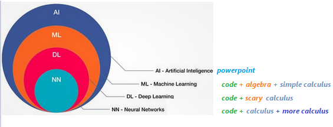

# Machine Learning for General Ledger

This tutorial is gentle introduction to understand deep learning concepts with help of real life examples.
This chapter demonstrates, how to train Finance data on given dataset and predict values.

_This chapter is very detailed, beginner friendly tutorial and assume no prior ML experience._

For experienced programmers, please skip to [Use Cases](@ref) section below.

!!! info "Objective"

    Objective and end goal of this tutorial is to analyze, evaluate and predict Organization growth (including but not limited to stock prices, Finance statements), based on technical analysis (stock prices, volumes etc.) and fundamental analysis (Finance Statements, Accounting and sub ledger details) combined together.
    [GL Processes](@ref) and [GL ERD](@ref).

-- What is AI, ML and Deep Learning

as per Wikipedia
The term "artificial intelligence" is intelligence demonstrated by machines, as opposed to natural intelligence displayed by humans and animals. Major AI researchers, now define AI in terms of rationality and acting rationally, which does not limit how intelligence can be articulated.

When Machines are trained to learn problem solving skills by use of information, this process of learning is Machine Learning. Further Deep learning is a special type of Machine learning where neural networks are used for learning purpose to solve a problem.

Now, introduction is out of the way, let’s learn meaning of these big words by actually doing it.

here are new AI, ML & DL definitions.

- If you see a Power Point, it's an AI.
- If you see code with calculus you understand, it's ML.
- If you see code with calculus you don't understand, it's DL.
- If you see calculus wrapped in layers, is NN,
- if calculus after calculus, is C/RNN,
- If calculus remembering calculus is LSTM,
- If calculus with physics is PINN
- And so on…so forth…



---

-- Data

Data is useful information described in terms of numbers, text, audio, video, images or any other format which can be read, write and understood in computers.

---

-- Functions

```math
    y = f(x)
```

In functional programming languages, Function is defined as an object, which take input values and maps to output values based on some logic.

--# Discrete Functions

Give a set or range of input values, if a function produces discrete and separate output (unconnected values), is a discrete function.
for example: number of people in a concert

```math
    y = f(x) = x + 12
```

```math
    y = f(300) = 312
```

--# Continuous Functions

Give a set or range of input values, if a function produces output which can take any value with in a finite or infinite interval (connected values), is a continuous function.
for example: height of one person in a concert may be anywhere within possible heights from 4ft to 7.2ft.

```math
    y = f(m, f) = (mother's height + father's height)/2
```

```math
    y = f(5, 6) = 5.5
```

```@repl
using Pkg;
using UnicodePlots;
plt = lineplot([cos], -π/2, 2π, title="Discrete & Continuous functions", name="Continuous");
scatterplot!(plt, randn(50),randn(50), name="Discrete Function")
```

---

-- Using Functions

Functions are smart, given an input value, it can always provide an output value.

We just learned essence of machine learning, if we know function logic, we can always predict output for a given input.

It's always true, however, problem is, we don't always know the logic, when function definition or logic is not known, Human, animals or machine fail to deliver output regardless of input available.

Most of the time, whether is working on mechanical, electrical or civil engineering projects, we can predict output based on inputs, provided problem/logistics are defined, calculated in certain ways using some functional formula, like
`F = ma or E = mc2`

But what if, when logistics or mechanism is not known or partially known, is it still possible to predict output just based on some input?

Let's pretend, if we have a magical function which given an input produces a rationally acceptable output.

Machine learning, is data science of finding this missing magical function, which given an input produces a rationally acceptable output.

---

--# Functions without any library

Let's take an example,

Time taken to travel between two cities via Air, Bus, Train or personal vehicle depends mostly depends on speed and distance. However, there are other factors like weather, season, population or faults, which may occasionally impact travel time.
However, knowing intensity of these factors, it's still possible to predict time taken rationally.

```@repl
using Pkg;
Pkg.add(url="https://github.com/AmitXShukla/GeneralLedger.jl.git");
using GeneralLedger;
GeneralLedger.getSampleDataTimeTaken(5)
```

_There are many assumptions when calculating Time taken,
like, Passenger time taken for preparation or time to travel to bus, train station is not reflected in calculations.
Let's capture these assumptions as bias for now._

--# Finding magical function

Let's assume that we don't know "time taken" formula or some reason like we don't exactly know speed of UFO or Jet Pack, how else we would know how much time it’s going to take to reach to destination when facts are unknown.

Answer may surprise you,

Ask a daily/weekly train or bus commuter, a person who has traveled long enough between two places, often knows and can rationally predict time taken in journey using different vehicles.

Of course, `Time Taken = d/s + b` may give same or better results,
but it's been observed, if a person's mind is trained (traveled in this case) enough (aka is experienced), can predict and often beat pre-defined formulas and even apply learnings on unknown/unseen circumstances.

In a nutshell, human mind has magical functions stored in brain cells, let's call them neurons, which is trained on data rather than formulas. Using Trained functions, one can apply learning rationally and predict outcome.

Neural network deep learning is nothing but an art of finding this magical function which can be used to rationally predict outcomes based on some input data.

---

-- Finance Mathematics

There is no such thing as Finance Math. Math is Math, the mother of all languages.
However, since our topic of interest is Finance, we will learn Mathematics from Finance perspective, which again is no different, other than more focused on Financial calculations.

Let's take another example, which is more familiar and relevant to Finance community.

```html
    BD = Buddy Deposit
    CD = Certificate of Deposit 
    P = Principal amount 
    r = R/100 
    R = Rate of Interest 
    T = Time in years 
    n = compound (365 = daily, 12=monthly, 1=yearly)
```

--# Buddy Deposit system

let’s say, one borrows money from buddy and return it on a simple yearly calculated interest condition (n=1). Lets assume, amount returned to friend has least constraints, like, if amount is returned less than 6 months, friends may not ask for any interest. For calculation purpose, we will keep formula very simple.

```math
    BD = P (1 + r*t/n)
```

Using above formula, one can safely predict,
The total amount accrued, principal plus interest, with simple interest on a principal of `$100,000.00` at a rate of `3.875%` per year over `7.5` years is `$129,062.50`.

### Certificate Deposit, with complex compound interest

```math
    CD = P (1 + r/n)^n*T
```

Using above formula, one can safely predict,
The total amount accrued, principal plus interest, with compound interest on a principal of `$100,000.00` at a rate of `3.875%` per year compounded `n=365` times per year over `7.5` years is `$133,724.24`.

```html
A = P + I 
where P (principal) = $100,000.00 I (interest) = $33,724.24

Calculation Steps: 
    First, convert R as a percent to r as a decimal 
    r = R/100 r = 3.875/100
    r = 0.03875 rate per year
    
    Then solve the equation for A 
    A = P(1 + r/n)^nt 
    A = 100,000.00*(1 + 0.03875/365)^(365)(7.5) 
    A = 100,000.00*(1 + 0.00010616438356164)^(2737.5) 
    A = $133,724.24
```

-- ### Mutual Fund Deposit

```math
    MFDeposit = GOK ^ (god*only*knows)
```

### Sample Deposit data

Let's look at few sample results produced by different deposit types.

```@repl
using Pkg;
Pkg.add(url="https://github.com/AmitXShukla/GeneralLedger.jl.git");
using GeneralLedger, UnicodePlots, DataFrames, Statistics;

sampleSize = 100000;
df = GeneralLedger.getSampleDepositsData(sampleSize);
first(df,5)
select!(df, :,
    [:deposit, :rate] => ByRow((x1, x2) 
        -> contains(x1, "MF") ? x2 :
        string(x1,"-",x2)) => :depositType);
dfG = groupby(df, :depositType);
dfT = sort(combine(dfG, :Total => mean),[:depositType]);
first(dfT, 9)

UnicodePlots.barplot(dfT.depositType, dfT.Total_mean, title="Return by deposit", name="", xlabel="amount", ylabel="Deposit Type")
```

---

### Univariate and Multivariate

**Univariate** statistical analysis refers to data analysis, when output depends only on one variable.

**Multivariate** statistical data analysis is applicable where output depends on more than one variables.

For example, in case of Buddy deposit, your friend promised to pay you back borrowed money with or without any interest or fixed or non-fixed time period (whenever  available). After all, Buddy don't charge interest. In this case, amount received entirely depends on Principal amount borrowed, is a case if simple Univariate analysis.

In other case, when money is deposited as an investment, amount received on maturity depends on Principal amount, rate of interest, duration and interest type etc. is an example of Multivariate statistical analysis.

Let's take a closer look at few `Univariate & Multivariate statistical analysis` example, how amount received on maturity depends on associated variables.

for example, Amount received after a buddy deposit depends on interest rate and time.

```@repl
using Pkg;
Pkg.add(url="https://github.com/AmitXShukla/GeneralLedger.jl.git");
using GeneralLedger, CairoMakie;

fileName = "bd_appendPlt1.gif";

rate = [1.875, 2.875, 3.875, 4.875, 5.875];
deposit = GeneralLedger.Deposit(100_000.0, rate[1], 1.0, 60.0);
points1 = Observable(Point2f[(0, 0)]);
points2 = Observable(Point2f[(0, 0)]);
points3 = Observable(Point2f[(0, 0)]);
points4 = Observable(Point2f[(0, 0)]);
points5 = Observable(Point2f[(0, 0)]);
# titleText = Observable(0.0) # uncomment to display $$ in title

fig, ax = scatter(points1;
            figure = (;backgroundcolor = :lightgrey, resolution=(600,600)),
            axis = (;
            title="Return by deposit",
            # title = @lift("Total Return = $($titleText)"),
            xlabel="time (months)",
            ylabel="Amount (100k)",
            xticklabelrotation=pi/3,
            yticklabelrotation=pi/3,
            limits = (0, 72, 90, 150)
            ), label = "\$ $(deposit.principal/1000) k @ $(rate[1]) % simple interest");
scatter!(ax, points2; label = "\$ $(deposit.principal/1000) k @ $(rate[2]) % simple interest");
scatter!(ax, points3; label = "\$ $(deposit.principal/1000) k @ $(rate[3]) % simple interest");
scatter!(ax, points4; label = "\$ $(deposit.principal/1000) k @ $(rate[4]) % simple interest");
scatter!(ax, points5; label = "\$ $(deposit.principal/1000) k @ $(rate[5]) % simple interest");
axislegend();

frames = 1:60;

record(fig, fileName, frames;
        framerate = 10) do t
    deposit.time = t
    deposit.rate = rate[1]
    points1[] = push!(points1[], Point2f(t, GeneralLedger.getSampleBDeposit(deposit)[2]/1000))
    deposit.rate = rate[2]
    points2[] = push!(points2[], Point2f(t, GeneralLedger.getSampleBDeposit(deposit)[2]/1000))
    deposit.rate = rate[3]
    points3[] = push!(points3[], Point2f(t, GeneralLedger.getSampleBDeposit(deposit)[2]/1000))
    deposit.rate = rate[4]
    points4[] = push!(points4[], Point2f(t, GeneralLedger.getSampleBDeposit(deposit)[2]/1000))
    deposit.rate = rate[5]
    points5[] = push!(points5[], Point2f(t, GeneralLedger.getSampleBDeposit(deposit)[2]/1000))
    # titleText[] = round(new_point[2], digits=2)
end
```


for example, Amount received after a certificate deposit depends on interest rate, compound type and time.

```@repl
using Pkg;
Pkg.add(url="https://github.com/AmitXShukla/GeneralLedger.jl.git");
using GeneralLedger, CairoMakie;

fileName = "bd_appendPlt2.gif";

rate = [1.875, 2.875, 3.875, 4.875, 5.875];
deposit = GeneralLedger.Deposit(100_000.0, rate[1], 1.0, 60.0);
points1 = Observable(Point2f[(0, 0)]);
points2 = Observable(Point2f[(0, 0)]);
points3 = Observable(Point2f[(0, 0)]);
points4 = Observable(Point2f[(0, 0)]);
points5 = Observable(Point2f[(0, 0)]);
# titleText = Observable(0.0) # uncomment to display $$ in title

fig, ax = scatter(points1;
            figure = (;backgroundcolor = :lightgrey, resolution=(600,600)),
            axis = (;
            title="Return by deposit (Simple compound)",
            # title = @lift("Total Return = $($titleText)"),
            xlabel="time (months)",
            ylabel="Amount (100k)",
            xticklabelrotation=pi/3,
            yticklabelrotation=pi/3,
            limits = (0, 72, 90, 150)
            ), label = "\$ $(deposit.principal/1000) k @ $(rate[1]) % CD interest");
scatter!(ax, points2; label = "\$ $(deposit.principal/1000) k @ $(rate[2]) % CD interest");
scatter!(ax, points3; label = "\$ $(deposit.principal/1000) k @ $(rate[3]) % CD interest");
scatter!(ax, points4; label = "\$ $(deposit.principal/1000) k @ $(rate[4]) % CD interest");
scatter!(ax, points5; label = "\$ $(deposit.principal/1000) k @ $(rate[5]) % CD interest");
axislegend();

frames = 1:60;

record(fig, fileName, frames;
        framerate = 10) do t
    deposit.time = t
    deposit.rate = rate[1]
    points1[] = push!(points1[], Point2f(t, GeneralLedger.getSampleCDeposit(deposit)[2]/1000))
    deposit.rate = rate[2]
    points2[] = push!(points2[], Point2f(t, GeneralLedger.getSampleCDeposit(deposit)[2]/1000))
    deposit.rate = rate[3]
    points3[] = push!(points3[], Point2f(t, GeneralLedger.getSampleCDeposit(deposit)[2]/1000))
    deposit.rate = rate[4]
    points4[] = push!(points4[], Point2f(t, GeneralLedger.getSampleCDeposit(deposit)[2]/1000))
    deposit.rate = rate[5]
    points5[] = push!(points5[], Point2f(t, GeneralLedger.getSampleCDeposit(deposit)[2]/1000))
    # titleText[] = round(new_point[2], digits=2)
end
```


Amount received after a certificate deposit depends on different compound interest rate type and time.

```@repl
using Pkg;
Pkg.add(url="https://github.com/AmitXShukla/GeneralLedger.jl.git");
using GeneralLedger, CairoMakie;

fileName = "bd_appendPlt3.gif";

rate = [1.875, 2.875, 3.875, 4.875, 5.875];
compound = [1.0, 4.0, 12.0, 365.0]
deposit = GeneralLedger.Deposit(100_000.0, rate[3], 1.0, 60.0);
points1 = Observable(Point2f[(0, 0)]);
points2 = Observable(Point2f[(0, 0)]);
points3 = Observable(Point2f[(0, 0)]);
points4 = Observable(Point2f[(0, 0)]);
points5 = Observable(Point2f[(0, 0)]);
# titleText = Observable(0.0) # uncomment to display $$ in title

fig, ax = scatter(points1;
            figure = (;backgroundcolor = :lightgrey, resolution=(600,600)),
            axis = (;
            title="Return by deposit ($(rate[3]) , different compound types)",
            # title = @lift("Total Return = $($titleText)"),
            xlabel="time (months)",
            ylabel="Amount (100k)",
            xticklabelrotation=pi/3,
            yticklabelrotation=pi/3,
            limits = (0, 72, 100, 130)
            ), label = "\$ $(deposit.principal/1000) k @ annual compound interest");
scatter!(ax, points2; label = "\$ $(deposit.principal/1000) k @ qtr compound interest");
scatter!(ax, points3; label = "\$ $(deposit.principal/1000) k @ monthly compound interest");
scatter!(ax, points4; label = "\$ $(deposit.principal/1000) k daily compound interest");
axislegend();

frames = 1:60;

record(fig, fileName, frames;
        framerate = 10) do t
    deposit.time = t
    deposit.compound = compound[1]
    points1[] = push!(points1[], Point2f(t, GeneralLedger.getSampleCDeposit(deposit)[2]/1000))
    deposit.compound = compound[2]
    points2[] = push!(points2[], Point2f(t, GeneralLedger.getSampleCDeposit(deposit)[2]/1000))
    deposit.compound = compound[3]
    points3[] = push!(points3[], Point2f(t, GeneralLedger.getSampleCDeposit(deposit)[2]/1000))
    deposit.compound = compound[4]
    points4[] = push!(points4[], Point2f(t, GeneralLedger.getSampleCDeposit(deposit)[2]/1000))
    # titleText[] = round(new_point[2], digits=2)
end
```


---

## Statistics

So far, we have seen examples of simple, compound interest certificate deposit types.
Now let's dig in deeper and move onto another type of deposit types, i.e. Mutual Funds, stocks, options equity etc.

Before we jump on to more advance Machine learning training, model and predictive analytics, let's spend time on analysis and visualizing data first.

Above analysis is the key to machine learning and predictive analytics. Understanding below statistical concepts lay strong foundations for ML/DL modeling later on.

In this section, we will focus on performing Univariate analysis on Mutual fund data, as you can see in below data sample, that rate type, compound interest type does't impact MF performance, in this dataset, outcome depends on only one variable, "Group Type".

**Once we get a hang of analyzing data on one variable, later we will introduce more variables like MF Type, contents, market type etc.
Then in later section, we will train our neural network on multiple inputs.**

```@repl
# first draw one million data samples from GeneralLedger.jl package
# groupby data by deposit type
# as you can see, we are focused on MF type data for now
# filter data to include only Mutual Funds

using Pkg;
Pkg.add(url="https://github.com/AmitXShukla/GeneralLedger.jl.git");
using GeneralLedger, CairoMakie, DataFrames, Statistics;

sampleSize = 1000000;
df = GeneralLedger.getSampleDepositsData(sampleSize);
subset!(df, :deposit => x -> contains.(x, "MF"));
first(df, 5)
dfG = groupby(df, [:rate]);
combine(dfG, nrow, proprow, groupindices, :Total => mean => :mean, :Total => std => :std)

# filter data to include only Group A
dfA = subset(df, :rate => x -> isequal.(x, "Group A"));
describe(dfA.Total)

# as you can see, above data set is divided in 4 groups and each group has different type of outcomes.
# we will assume, these groups have further characteristics, which lead them to produce outcome in certain ranges
# for example, Group A invests in certain types of equities which performed better or worse than others,
# however, with in a group, outcome are somewhat consistent (like in certain range),
# abnormal distribution with in one certain group is another topic for detail analysis
# for now, we will only focus on doing analytics at one group level.

# let's visualize groups altogether and individually in a bar plot to observe distributions

sampleSize = 10000;
df = GeneralLedger.getSampleDepositsData(sampleSize);
subset!(df, :deposit => x -> contains.(x, "MF"));
dfG = groupby(df, [:rate]);
dfC = combine(dfG, nrow, proprow, groupindices, :Total => mean => :mean, :Total => std => :std);

figBarPlot = Figure(backgroundcolor=:lightgrey, resolution=(600,400), fonts = (; regular = "CMU Serif"));
axFBP = Axis(figBarPlot[1,1], title="Rows, Stats by Mutual Fund Group", xlabel="MF Groups", xgridvisible=false,
xticklabelrotation=pi/3, yticklabelrotation=pi/3, xticks = (1:4, dfC.rate));
plt = CairoMakie.barplot!(axFBP, dfC.groupindices, dfC.nrow,
        stack = dfC.nrow,
        color = dfC.nrow,
        label = "Row Distributions");
CairoMakie.lines!(axFBP, dfC.groupindices, dfC.mean/100,
        stack = convert.(Int64, round.(dfC.mean/100)),
        color = convert.(Int64, round.(dfC.mean/100)),
        label = "mean (in 100s)");
CairoMakie.scatterlines!(axFBP, dfC.groupindices, dfC.std/4,
        label = "std (in 250s)" );
axislegend(position = :ct);

save("group_data.png", figBarPlot);

# Normal |Gaussian, Binomial, Poisson, Exponential

# what are mean, mode, median
# Moments e.g mean, variance, skewness, and kurtosis), entropy, and other properties

```


--# Probability and Distributions

what is a statistical data probability distribution anyway?

in simple english, we tend to represent a set of data by a representative value which would approximately define the entire collection. This representative value is called the measure of central tendency, and the name suggests that it is a value around which the data is centred. These central tendencies are mean, median and mode.

For example, give a set of 100k Mutual Fund or Stock prices results, we want to have a general idea of about how each Mutual Fund or stock prices is performing in over all market conditions.

And given, how data is distributed across central tendency is defined as Distributions. Before we start looking at different distributions types like Normal | Gaussian, Poisson, Exponential. Let's understand basic of probability and few probability distribution functions.

Probability and Distributions help us understand general data tendencies in statistical analysis.
Let's dig in some details to learn from examples.

!!! note "what's the point of learning statistics for Finance ML"
    If you are wondering, why we even care of learning probability, statistics, algebra and calculus functions for the sake of Finance Analytics.
    It's because building AI, is all about using mathematics to find statistical association to rationally predict outcome of an event given a set of inputs, than casual reasoning.

    As we progress, you will see, how learning statistical associations and using calculus for automation in small steps,
    lead to performing statistical tasks, automate predictive analytics, which are fast improved fact based statistical association rather than casual reasoning, and often outperforms human intuitive analytics.

-- Probability Distributions Functions (PDFs)

--# Probability

A probability event is defined as set of outcomes of an experiment. In simpler words, Probability is likelihood of occurrence of an event.

--# Sample space

All set of possible set of outcomes of an experiment is the sample space.

let's assume, given there are 4 possible directions (``North``, ``South``, ``East``, ``West``).

- Probability of person walking in North Direction is `1/4`. Given Sample space (``North``, ``South``, ``East``, ``West``).
- Probability of person walking in ``North``(ish) Direction is `3/8`. Given Sample space is `(N, NE, NW, S, SE, SW, E, W)`.

`Determining statistical probability accurately depends on context and sample space.`

```@repl
using Pkg;
using CairoMakie;

tblA = (direction=["N","S","E","W"],
        prob=repeat([1/4], inner=4));
tblB = (direction=["N","S","E","W","NE","NW","SE","SW"],
        prob=repeat([1/8], inner=8));

fig = Figure(backgroundcolor=:white, resolution=(600,300), 
    fonts = (; regular= "Sans Serif"));
axa = Axis(fig[1,1], xlabel="distributions", ylabel="probability", 
    xgridvisible=false, ygridvisible=true, ygridstyle = :dash,
    xticks = (1:length(tblA.prob), tblA.direction), xticklabelrotation=pi/3, 
    limits=(0,5,0,0.3),
    title="Probability Distribution");
axb = Axis(fig[1,2], xlabel="distributions",
    xgridvisible=false, ygridvisible=false, ygridstyle = :dash,
    xticks = (1:length(tblB.prob), tblB.direction), xticklabelrotation=pi/3, 
    limits=(0,9,0,0.3),
    yticksvisible=false,
    title="Probability Distribution");

barplot!(axa, tblA.prob, label = "Sample Space 4", color=(:dodgerblue, 0.5), strokewidth=0.5);
barplot!(axb, tblB.prob, label = "Sample Space 8", color=(:orange, 0.5), strokewidth=0.5);
axislegend(axa, position=:cb);
axislegend(axb);

save("prob.png", fig);

```


--# Probability axioms

- The probability of occurrence of any event lies between 0 and 1.
    ``P(X) \in (0,1)``
- The sum of all the probabilities of outcomes should be equal to 1.
    ``P(\Omega) = 1``
- For mutually exclusive events, sum of probabilities is equal to sum of individual event probabilities.
    ``P\left(\bigcup _{i=1}^{\infty }E_{i}\right)=\sum _{i=1}^{\infty }P(E_{i}).``

--# Probability consequences

- The probability of occurrence of any event lies between 0 and 1.
    ``P(X) \in (0,1)``
- The sum of all the probabilities of outcomes should be equal to 1.
    ``P(\Omega) = 1``
- For mutually exclusive events, sum of probabilities is equal to sum of individual event probabilities.
    ``P\left(\bigcup _{i=1}^{\infty }E_{i}\right)=\sum _{i=1}^{\infty }P(E_{i})``

--# PDFs

Probability Distribution functions (referred as PDFs), not to be confused with Probability density function (PDF),
is the mathematical function that gives the probabilities of occurrence of different possible outcomes for an experiment. It is a mathematical description of a random phenomenon in terms of its sample space and the probabilities of events (subsets of the sample space).

```math
    PDFs \Rrightarrow
    \left[\begin{array}{c}
        Discrete \Leftrightarrow PMF \\
        Continuous \Leftrightarrow PDF
    \end{array}\right]
    \Rrightarrow 
    CDF
```

!!! info "what's the point of learning PDFs"
    just to keep reader and ojective of this tutorials aligned, the whole reason, we are learning about probability distributions is, it helps us visualize data in terms of "central or distrbuted" tendancy and/or estimating an event or point of interest in terms of maximum likelihood of occurance.

PDF, PMF, CDF

Probability density/mass functions (pdf) and their logarithm (logpdf)

-- Distributions

Normal | Gaussian, Poisson, Exponential, pdf

--# what are mean, mode, median

krutis, entropy, etc.

-- Hypothesis, p - value

-- what is a gradient, derivatives, gradients, Jacobians, Hessians

-- what is optimization

-- ForwardDiff, ReverseDiff

-- ChainRules, AutoDiff

AutoGrad | AutoDiff (automatic differentiation)

-- Optimization using gradient

-- what is gradient descent

-- UAT Universal Approximation theorem

As per Wikipedia -

In the mathematical theory of artificial neural networks, universal approximation theorems are results, that establish the density of an algorithmically generated class of functions within a given function space of interest.

In simple English..

if you set knobs, levers (aka parameters..) of a given UAT function in such a way, this UAT function starts working as the magical function described above (i.e. universal approximation).

-- Linear regression

-- Taylor Series

-- Fourier Transformation

-- Loss function

-- Gradient & Gradient Descent

-- Curse of Dimensionality

-- what is a Neural network

-- Neurons

-- Why we need layers

-- What are activation functions

-- Training neural networks

-- Predicting results

What is a neural network
A neural network is the magical function:
NN(x)= W(n)σ(n-1)…..(W3σ2(W2σ1(W1x+b1)+b2)+b3…. bn)
where W & b (weight & bias) are changeable, represent parameters of a given layer in multi "n" layer function and when these knobs & lever, aka parameters(weights, bias) are trained to tune properly, can produce a rationally acceptable output given a set of input values.

For the beginner, let's simplify this and work on a single layer.

NN(x) = W1x + b

How computer works and what is GPU

Stack vs HEAP

Programming Languages and ML Frameworks

UAT
This means that NN(x) is now a very good function approximator to f(x) = ones(5)!
So Why Machine Learning? Why Neural Networks?
All we did was find parameters that made NN(x) act like a function f(x). How does that relate to machine learning? Well, in any case where one is acting on data (x,y), the idea is to assume that there exists some underlying mathematical model f(x) = y. If we had perfect knowledge of what f is, then from only the information of x we can then predict what y would be. The inference problem is to then figure out what function f should be. Therefore, machine learning on data is simply this problem of finding an approximator to some unknown function!
So why neural networks? Neural networks satisfy two properties. The first of which is known as the Universal Approximation Theorem (UAT), which in simple non-mathematical language means that, for any ϵ of accuracy, if your neural network is large enough (has enough layers, the weight matrices are large enough), then it can approximate any (nice) function f within that ϵ. Therefore, we can reduce the problem of finding missing functions, the problem of machine learning, to a problem of finding the weights of neural networks, which is a well-defined mathematical optimization problem.
Why neural networks specifically? That's a fairly good question, since there are many other functions with this property. For example, you will have learned from analysis that a0+a1x+a2x2+…a0+a1x+a2x2+… arbitrary polynomials can be used to approximate any analytic function (this is the Taylor series). Similarly, a Fourier series
f(x)=a0+∑kbkcos(kx)+cksin(kx)f(x)=a0+∑kbkcos⁡(kx)+cksin⁡(kx)
can approximate any continuous function f (and discontinuous functions also can have convergence, etc. these are the details of a harmonic analysis course).
That's all for one dimension. How about two dimensional functions? It turns out it's not difficult to prove that tensor products of universal approximators will give higher dimensional universal approximators. So for example, tensoring together two polynomials:
a0+a1x+a2y+a3xy+a4x2y+a5xy2+a6x2y2+…a0+a1x+a2y+a3xy+a4x2y+a5xy2+a6x2y2+…
will give a two-dimensional function approximator. But notice how we have to resolve every combination of terms. This means that if we used n coefficients in each dimension d, the total number of coefficients to build a d-dimensional universal approximator from one-dimensional objects would need ndnd coefficients. This exponential growth is known as the curse of dimensionality.

A fundamental problem that makes language modeling and other learning problems difficult is the
curse of dimensionality. It is particularly obvious in the case when one wants to model the joint
distribution between many discrete random variables (such as words in a sentence, or discrete at-
tributes in a data-mining task). For example, if one wants to model the joint distribution of 10
consecutive words in a natural language with a vocabulary V of size 100,000, there are potentially
100 00010 − 1 = 1050 − 1 free parameters.

From <https://www.jmlr.org/papers/volume3/bengio03a/bengio03a.pdf>

NN Function
Background
Neural networks (NNs) are a collection of nested functions that are executed on some input data. These functions are defined by parameters (consisting of weights and biases), which in PyTorch are stored in tensors.
Training a NN happens in two steps:

Gradient

Gradient descent

Forward pass
copied from PyTorch
Forward Propagation: In forward prop, the NN makes its best guess about the correct output. It runs the input data through each of its functions to make this guess.

Backward propagation
copied from PyTorch
Backward Propagation: In backprop, the NN adjusts its parameters proportionate to the error in its guess. It does this by traversing backwards from the output, collecting the derivatives of the error with respect to the parameters of the functions (gradients), and optimizing the parameters using gradient descent. For a more detailed walk through of backprop, check out this video from 3Blue1Brown.

Auto Grad

Automatic Differentiation

Loss function

Generalization

Regularization

Optimization

Epoch

Layers
Why we need so many layers?

Activation functions
Why we need activation functions in NN

Training
Testing
Predictions

---

## Use Cases

- Finance Ledger ACTUALS - Predict $$ by ACCOUNT Classifications
- Finance Ledger ACTUALS - Predict $$ by REGION Classifications
- Dynamic roll ups
- Invoices by Diversity Vendor groups
- Predict Duplicate/Fuzzy Vendor Invoices
- Vendor Ranking
- Product Ranking
- Cost per Invoice
- Operating Expenses trend
- Supply chain Inventory Dashboard
