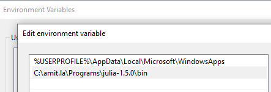
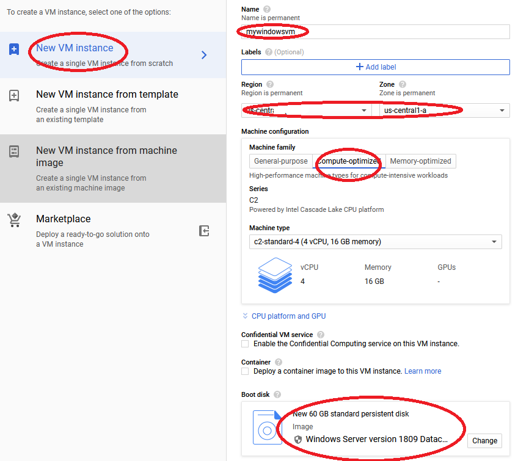
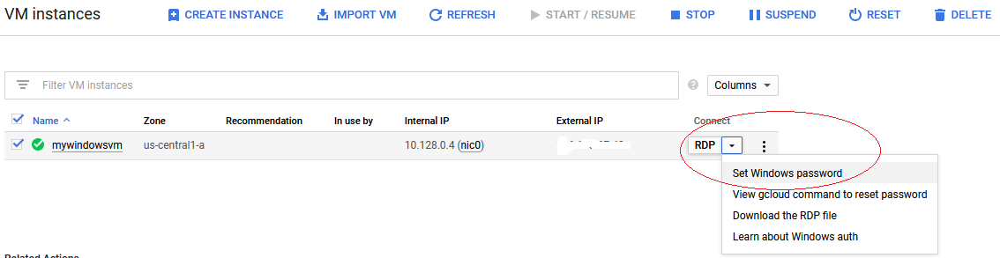
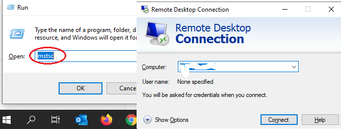
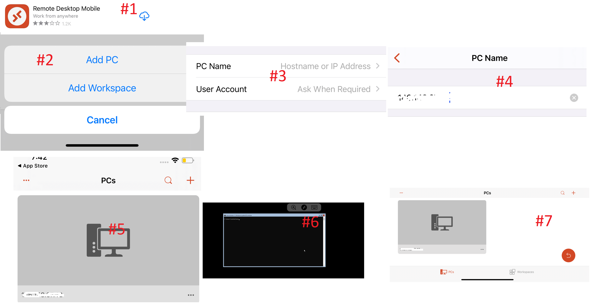
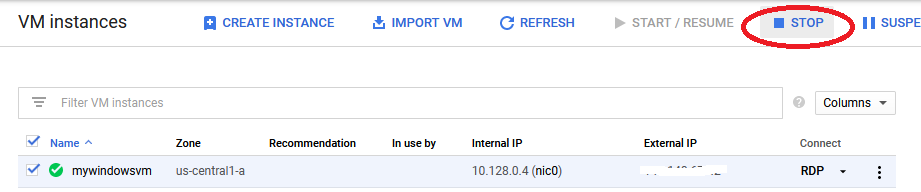
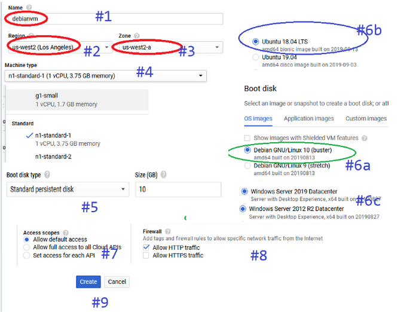
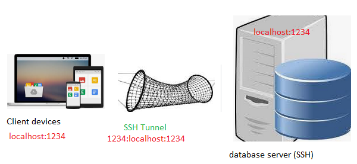
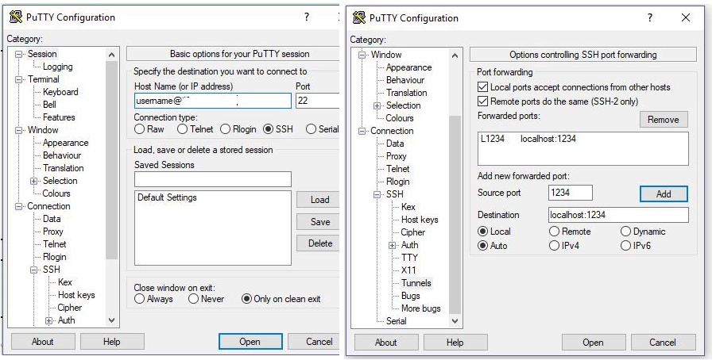

# Installing Julia Environment

It takes less than one minute to setup Julia environment on any machine, So I'm sharing few other possible installation methods to setup your local machine, remote VMs or mobile devices for Julia computing.

Please chose any of the below methods depending on your available resources you would like to setup Julia environment for General Ledger data analysis.

**iPad is next computer** and [](https://julialang.org) is next big thing in high speed parallel, distributed & asynchronous numerical computing. 

In this blog, I'm sharing, how I setup my iPad as primary developer machine to run heavy data science numerical computing over cloud VMs.

**how to install & access Julia, Jupyter, Pluto, VSCode on local & Cloud VMs.**

*These hacks are for people like me, who wake up middle of night and expect a Julia notebook ready in less than 10 seconds on their mobile device.*

**Topics**
1. how to install Julia on local windows, mac, linux
2. how to install Julia on Cloud Windows VM
3. how to install Julia on Cloud Linux VM
4. run Julia REPL on Cloud Windows, Linux VMs through SSH client
5. run Pluto or Jupyter notebooks on VM servers and access from remote Browser, iPad or Android tablets
6. use GitHub to sync your work
7. run VS Code on iPad/Tablet devices
8. Understanding Julia Project, Application, Environment, Package
---


## on local windows, mac, linux

it takes less than one minute to install and start with Julia.

[click here to download Julia Language binaries](https://julialang.org/downloads/)


Extract zip file contents to any folder on your local machine and change Windows/Mac/Linux environment variables/system Path to find Julia.exe on this folder.

*for example*
+ Windows
	$env:PATH
	C:\amit\julia-1.5.2\bin

+ Linux/mac
	export PATH=$PATH:/place/with/the/julia-1.5.2/bin
    


+ now open a terminal window and type
	julia

if all is well, you should have a working Julia session as shown below


---
## on Cloud Windows VM

Before you begin

Make sure that billing is enabled for your Google Cloud Platform project. open [Google Cloud](https://console.cloud.google.com).

	browse to Compute Engine -> VM Instances -> New VM Instance

**Let's spin a moderate size windows compute Optimized VM in Google cloud**




**Once Google VM is installed, please start the machine and setup windows password**



**Connecting from local windows machine to this Cloud Windows VM**



**Use your iPAD to connect to Google Cloud Windows VM**



Once your windows server is up and running, follow Section #1 (see above) for Julia Lang installation.

**Don't forget to STOP your windows VM when you finish.**



---
## on Cloud Linux VM

Before you begin
Make sure that billing is enabled for your Google Cloud Platform project. open [Google Cloud](https://console.cloud.google.com).

	browse to Compute Engine -> VM Instances -> New VM Instance

Let's spin a moderate size Linux compute Optimized VM in Google cloud



If you want a complete Linux desktop experience, please follow this blog.

[Detail instuctions - How to Install Debian 10 (Buster) or Ubuntu 18/19 Desktop on Google Cloud and access through VNC](https://medium.com/@Amit_Shukla/how-to-install-debian-10-buster-or-ubuntu-18-19-desktop-on-google-cloud-and-access-through-vnc-687c05d0d263)

Once your Linux VM server is up and running, follow Section #1 (see above) for Julia Lang installation.

---

## run Julia REPL on Cloud Windows, Linux VMs through SSH client

download Julia binaries and setup system PATH as discussed in Section #1 above.

- Linux/mac export PATH=$PATH:/place/with/the/julia-1.5.2/bin

On **Windows cloud VM**, this is simple setup, open PORT:1234 for remote access.

On **Linux cloud VM**, User will need set up an SSH tunnel.

- local computer - download putty
- Google Cloud- open [Google Cloud](https://console.cloud.google.com). click on SSH, this will open a SSH inside browser pop-up window.

First, log in to your server using SSH and start a Pluto server. Then open a local terminal on your own computer and type:

	ssh userid@vmipaddress -LN 1234:localhost:1234
----

---

## run Jupyter & Pluto notebook through remote browser

You can run Jupyter notebook or Pluto on a Windows/Linux VM and use the browser on your own computer or mobile device as user interface.

I'll split this section in two part, Jupyter and Pluto, let's get started with Jupyter first.

**5a. How to run & access Jupyter notebook through remote browser**

**5b. How to run & access Pluto notebook through remote browser**

---

*SSH Tunnel create a pathway to access your remote cloud VM server*



----

## 5a. How to run & access Jupyter notebook through remote browser

on your server, first start Jupyter environment using this command

```
Julia > Using Pkg; 
        Pkg.add("IJulia");
        using IJulia;
        installkernel("Julia (4 threads)", env=Dict("JULIA_NUM_THREADS"=>"4"))
            # JULIA_NUM_THREADS should be cores available as per your machine
        jupyterlab();
or

jupyter notebook --no-browser --port 1234

# above command will start a notebook server with URL like http://localhost:8888/?token=abc123........
```

- Access Jupyter notebook on Linux cloud VM

on your SSH window, type one of following commands

	ssh -L 1234:localhost:1234 username@xxx.xx.xx.xx
	ssh -L 1234:localhost:1234 -i /path/to/private_key

- Access Jupyter notebook on Windows cloud VM

**download and setup putty like this**



## 5b. How to run & access Pluto notebook through remote browser

on your server, type following commands

```
Julia > Using Pkg; 
        Pkg.add("Pluto")
        Pluto.CONFIG["PLUTO_RUN_NOTEBOOK_ON_LOAD"] = "false" Pluto.ENV_DEFAULTS["PLUTO_RUN_NOTEBOOK_ON_LOAD"] = "false"
            # above command is optional and prevent notebook to auto-run on load
        Pluto.run(; launch_browser: "false", host: "0.0.0.0", port: 1234)
        
# above commands will start Pluto on http://[cloudvmipaddress]:[port]/

or
        
# alternate, like Jupyter, you can always access your Pluto notebook through SSH terminal as well
ssh user@ipaddress -LN 1234:localhost:1234
```

---

## use GitHub to sync your work

This section is just to remind you that using GitHub repositories saves you tons of re-work.
You can setup projects and sync your code across devices among teams.

Please check out this video playlist if you are new to GitHub to learn more.

[GitHub Video Tutorials](https://www.youtube.com/playlist?list=PLp0TENYyY8lFMOKZ9CSWto-BizmCyokib)

---
## run VS Code on iPad/Tablet devices using coder-server


- Step 1: You should already have a cloud Linux VM. (see Section #3 above)
- Step 2: login into your cloud VM through SSH (see Section #4 above)
- Step 3: type below commands one by one in SSH window

```
wget https://github.com/cdr/code-server/releases/download/v3.7.1/code-server-3.7.1-linux-arm64.tar.gz
    # above command will download latest copy of code-server binaries, 
    # https://github.com/cdr/code-server/releases. change the binaries version to latest available release as per your machine configuration
tar -xvf ./code-server-3.7.1-linux-arm64.tar.gz coder
    # above command will unzip code binaries
cd coder
    # change directory to coder folder
chmod +x ./coder
    # change executable permission on this folder
sudo ufw allow 80/tcp
    # allow http access on port 80 to this folder
./coder -p 80 --allow-http
    # note down password
```

open any browser window on your mobile/computer and access this URL

http://yourcloudvmipaddress/

you should now have vscode running on your browser window.

---

# Understanding Julia Project, Application, Environment, Package
Each of these terms above describes what are you trying to achieve.

**A Julia language Project** is literally a project, reflects your objective you are trying to accomplish in your project.
Like any other software project, your project has source code files typically placed under src directory, documentation under docs and test cases kept in test directory.

**Application** is a kind of project trying to achieve a specific goal, for example, a micro services or web app or Research analysis or white paper. Applications unlike Package & Environment don't need UUID. It can be a simple notebook or Julia file. Applications can provide global configuration, whereas packages cannot.


**Environment** is a Julia Lang environment, which completely describes all packages and related dependency. Julia environment typically keep required packages (specific UUID  universal unique identifier) in project.toml and manifesto.toml complete dependency graph of packages.

Environments are helpful to complete re-produce a work environment in any other developer machine.

**Package** is typically like a Julia Environment with a clear motive, that this package provide re-usable functionalities that can be used in other Julia language development environments/projects.

**Modules** are individual components of your overall Julia package which implement a discrete functionality.

learn more - 

https://julialang.github.io/Pkg.jl/dev/glossary/

https://julialang.github.io/Pkg.jl/dev/getting-started/