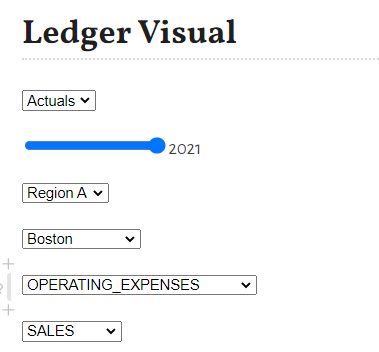
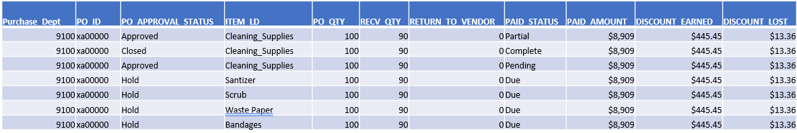

# Visualizations, Buttons, sliders, filters, n-D plots, plots vs graphs

In previous chapter, We created Finance datasets samples. 

In this section, we will again look into few examples.

These examples show case how to use, sliders, inputs, select boxes to dynamically change data and see data changes.

!!! warning
    Since this documentation is a static web page, at present, these example will NOT update data.
    
    In future, I will deploy my Pluto notebooks at Pluto server and update these sections to see live data.
    However, these code samples works well in local or remote Pluto server environment.

`TODO: host Pluto notebook here.`

## Would, Could, Should, What if scenarios

Below sliders, help update/filter data.

For example, User can select LEDGER TYPE, OPERATING_REGION, FISCAL_YEAR, LOCATIONS/REGIONS, ACCOUNT/LOCATION ROLL UP
to change data dynamically.

**sample PlutoUI sliders/input image**




additionally, Sliders are use to update data without change actual data for comparison.

`what if`

- Region A is merged with Region B
- Employee resume work from office, how much Travel amounts % will increase.
- % of Office supply expenses given to Employee as home office setup

- would Region A, Cash Flow Investment have returned 7% ROI
- would Region B received Government/investor funding

- could have increased IT operating expenses by 5%
- could have reduced HR temp staff

- should have paid vendor invoiced on time to recive rebate
- should have applied loan to increase production
- should have retired a particular Asset

## Income, Cash-Flow & Balance sheet statements

below is sample Finance Ledger Data with slicers, inputs

```@repl
using DataFrames, Plots, Dates

# create default binding values/params
using PlutoUI

## WARNING
## These bind variable will throw in error in documentation
## however, these runs fine on Pluto notebooks and provide a slider to change values dynamically

# @bind ld Select(["Actuals", "Budget"])
# @bind rg Select(["Region A", "Region B", "Region C"])
# @bind yr Slider(2020:1:2021, default=2020, show_value=true)
# @bind qtr Slider(1:1:4, default=1, show_value=true)
# @bind ld_p Select(["Actuals", "Budget"])
# @bind yr_p Slider(2020:1:2021, default=2021, show_value=true)
# @bind rg_p Select(["Region A", "Region B", "Region C"])
# @bind ldescr Select(unique(location.DESCR))
# @bind adescr Select(unique(accounts.CLASSIFICATION))
# @bind ddescr Select(unique(dept.CLASSIFICATION))

# create dummy data
accounts = DataFrame(AS_OF_DATE=Date("1900-01-01", dateformat"y-m-d"), 
					ID = 11000:1000:45000,
					CLASSIFICATION=repeat([
		"OPERATING_EXPENSES","NON-OPERATING_EXPENSES", "ASSETS","LIABILITIES",
		"NET_WORTH","STATISTICS","REVENUE"
		], inner=5),
	CATEGORY=[
		"Travel","Payroll","non-Payroll","Allowance","Cash",
		"Facility","Supply","Services","Investment","Misc.",
		"Depreciation","Gain","Service","Retired","Fault.",
		"Receipt","Accrual","Return","Credit","ROI",
		"Cash","Funds","Invest","Transfer","Roll-over",
		"FTE","Members","Non_Members","Temp","Contractors",
		"Sales","Merchant","Service","Consulting","Subscriptions"
	],
	STATUS="A",
	DESCR=repeat([
		"operating expenses","non-operating expenses",
		"assets","liability","net-worth","stats","revenue"
	], inner=5),
	ACCOUNT_TYPE=repeat([
	"E","E","A","L","N","S","R"
				],inner=5));
dept = DataFrame(AS_OF_DATE=Date("2000-01-01", dateformat"y-m-d"), 
							ID = 1100:100:1500,
							CLASSIFICATION=[
	"SALES","HR", "IT","BUSINESS","OTHERS"
	],
							CATEGORY=[
	"sales","human_resource","IT_Staff","business","others"
	],
							STATUS="A",
							DESCR=[
	"Sales & Marketing","Human Resource","Infomration Technology","Business leaders","other temp"
	],
							DEPT_TYPE=[
	"S","H","I","B","O"]);
location = DataFrame(AS_OF_DATE=Date("2000-01-01", dateformat"y-m-d"), 
							ID = 11:1:22,
							CLASSIFICATION=repeat([
	"Region A","Region B", "Region C"], inner=4),
							CATEGORY=repeat([
	"Region A","Region B", "Region C"], inner=4),
							STATUS="A",
							DESCR=[
"Boston","New York","Philadelphia","Cleveland","Richmond",
"Atlanta","Chicago","St. Louis","Minneapolis","Kansas City",
"Dallas","San Francisco"],
							LOCA_TYPE="Physical");
ledger = DataFrame(
		LEDGER = String[], FISCAL_YEAR = Int[], PERIOD = Int[], ORGID = String[],
		OPER_UNIT = String[], ACCOUNT = Int[], DEPT = Int[], LOCATION = Int[], 	
		POSTED_TOTAL = Float64[]
	);
	# create 2020 Period 1-12 Actuals Ledger 
	l = "Actuals";
	fy = 2020;
	for p = 1:12
		for i = 1:10^5
		push!(ledger, (l, fy, p, "ABC Inc.", rand(location.CATEGORY),
			rand(accounts.ID), rand(dept.ID), rand(location.ID), rand()*10^8))
		end
	end
	# create 2021 Period 1-4 Actuals Ledger 
	l = "Actuals";
	fy = 2021;
	for p = 1:4
		for i = 1:10^5
		push!(ledger, (l, fy, p, "ABC Inc.", rand(location.CATEGORY),
			rand(accounts.ID), rand(dept.ID), rand(location.ID), rand()*10^8))
		end
	end
	# create 2021 Period 1-4 Budget Ledger 
	l = "Budget";
	fy = 2021;
	for p = 1:12
		for i = 1:10^5
		push!(ledger, (l, fy, p, "ABC Inc.", rand(location.CATEGORY),
			rand(accounts.ID), rand(dept.ID), rand(location.ID), rand()*10^8))
		end
	end
ledger[:,:]

# Create Finance Statements

ld = "Actuals"
rg = "Region B"
yr = 2020
qtr = 1
ld_p = "Actuals"
rg_p = "Region B"
yr_p = 2020
qtr_p = 1
ldescr = unique(location.DESCR)
adescr = unique(accounts.CLASSIFICATION)
ddescr = unique(dept.CLASSIFICATION)

########################
##### BALANCE SHEET ####
########################

# rename dimensions columns for innerjoin
df_accounts = rename(accounts, :ID => :ACCOUNTS_ID, :CLASSIFICATION => :ACCOUNTS_CLASSIFICATION, :CATEGORY => :ACCOUNTS_CATEGORY, :DESCR => :ACCOUNTS_DESCR);
df_dept = rename(dept, :ID => :DEPT_ID, :CLASSIFICATION => :DEPT_CLASSIFICATION, :CATEGORY => :DEPT_CATEGORY, :DESCR => :DEPT_DESCR);
df_location = rename(location, :ID => :LOCATION_ID, :CLASSIFICATION => :LOCATION_CLASSIFICATION, :CATEGORY => :LOCATION_CATEGORY, :DESCR => :LOCATION_DESCR);

# create a function which converts accounting period to Quarter
function periodToQtr(x)
	if x ∈ 1:3
		return 1
	elseif x ∈ 4:6
		return 2
	elseif x ∈ 7:9
		return 3
	else return 4
	end
	end

##############################################################
# create a new dataframe to join all chartfields with ledger #
##############################################################

df_ledger = innerjoin(
		innerjoin(
			innerjoin(ledger, df_accounts, on = [:ACCOUNT => :ACCOUNTS_ID], makeunique=true),
			df_dept, on = [:DEPT => :DEPT_ID], makeunique=true), df_location,
	on = [:LOCATION => :LOCATION_ID], makeunique=true);
	transform!(df_ledger, :PERIOD => ByRow(periodToQtr) => :QTR);

function numToCurrency(x)
		return string("USD ",round(x/10^6; digits = 2), "m")
	end
	gdf = groupby(df_ledger, [:LEDGER, :FISCAL_YEAR, :QTR, :OPER_UNIT, :ACCOUNTS_CLASSIFICATION, :DEPT_CLASSIFICATION, 
			# :LOCATION_CLASSIFICATION,
			:LOCATION_DESCR]);
	gdf_plot = combine(gdf, :POSTED_TOTAL => sum => :TOTAL);

	select(gdf_plot[(
				(gdf_plot.FISCAL_YEAR .== yr)
				.&
				(gdf_plot.QTR .== qtr)
				.&
				(gdf_plot.LEDGER .== ld)
				.&
				(gdf_plot.OPER_UNIT .== rg)
				),:], 
		:FISCAL_YEAR => :FY,
		:QTR => :Qtr,
		:OPER_UNIT => :Org,
		:ACCOUNTS_CLASSIFICATION => :Accounts,
		:DEPT_CLASSIFICATION => :Dept,
		# :LOCATION_CLASSIFICATION => :Region,
		:LOCATION_DESCR => :Loc,
		:TOTAL => ByRow(numToCurrency) => :TOTAL)

########################
### Income Statement ###
########################

select(gdf_plot[(
				(gdf_plot.FISCAL_YEAR .== yr)
				.&
				(gdf_plot.QTR .== qtr)
				.&
				(gdf_plot.LEDGER .== ld)
				.&
				(gdf_plot.OPER_UNIT .== rg)
				.&
				(in.(gdf_plot.ACCOUNTS_CLASSIFICATION, Ref(["ASSETS", "LIABILITIES", "REVENUE","NET_WORTH"])))
				),:], 
		:FISCAL_YEAR => :FY,
		:QTR => :Qtr,
		:OPER_UNIT => :Org,
		:ACCOUNTS_CLASSIFICATION => :Accounts,
		# :DEPT_CLASSIFICATION => :Dept,
		# :LOCATION_CLASSIFICATION => :Region,
		# :LOCATION_DESCR => :Loc,
		:TOTAL => ByRow(numToCurrency) => :TOTAL)

########################
##### CASH FLOW ########
########################

select(gdf_plot[(
				(gdf_plot.FISCAL_YEAR .== yr)
				.&
				(gdf_plot.QTR .== qtr)
				.&
				(gdf_plot.LEDGER .== ld)
				.&
				(gdf_plot.OPER_UNIT .== rg)
				.&
				(in.(gdf_plot.ACCOUNTS_CLASSIFICATION, Ref(["NON-OPERATING_EXPENSES","OPERATING_EXPENSES"	])))
				),:], 
		:FISCAL_YEAR => :FY,
		:QTR => :Qtr,
		:OPER_UNIT => :Org,
		:ACCOUNTS_CLASSIFICATION => :Accounts,
		# :DEPT_CLASSIFICATION => :Dept,
		# :LOCATION_CLASSIFICATION => :Region,
		# :LOCATION_DESCR => :Loc,
		:TOTAL => ByRow(numToCurrency) => :TOTAL)


########################
##### Ledger Visual ####
########################

plot_data = gdf_plot[(
		(gdf_plot.FISCAL_YEAR .== yr_p)
		.&
		(gdf_plot.LEDGER .== ld_p)
		.&
		(gdf_plot.OPER_UNIT .== rg_p)
		.&
		(gdf_plot.LOCATION_DESCR .== ldescr)
		.&
		(gdf_plot.DEPT_CLASSIFICATION .== ddescr)
		.&
		(gdf_plot.ACCOUNTS_CLASSIFICATION .== adescr))
		, :];
	# @df plot_data scatter(:QTR, :TOTAL/10^8, title = "Finance Ledger Data", xlabel="Quarter", ylabel="Total (in USD million)", label="$ld_p Total by $yr_p for $rg_p")
	@df plot_data plot(:QTR, :TOTAL/10^8, title = "Finance Ledger Data", xlabel="Quarter", ylabel="Total (in USD million)", 
		label=[
			"$ld_p by $yr_p for $rg_p $ldescr $adescr $ddescr"
			],
		lw=3)
		
#################################
## Actual vs Budget Comparison ##
#################################

plot_data_a = gdf_plot[(
		(gdf_plot.FISCAL_YEAR .== yr_p)
		.&
		(gdf_plot.LEDGER .== "Actuals")
		.&
		(gdf_plot.OPER_UNIT .== rg_p)
		.&
		(gdf_plot.LOCATION_DESCR .== ldescr)
		.&
		(gdf_plot.DEPT_CLASSIFICATION .== ddescr)
		.&
		(gdf_plot.ACCOUNTS_CLASSIFICATION .== adescr))
		, :];
	# @df plot_data scatter(:QTR, :TOTAL/10^8, title = "Finance Ledger Data", xlabel="Quarter", ylabel="Total (in USD million)", label="$ld_p Total by $yr_p for $rg_p")
	plot_data_b = gdf_plot[(
		(gdf_plot.FISCAL_YEAR .== yr_p)
		.&
		(gdf_plot.LEDGER .== "Budget")
		.&
		(gdf_plot.OPER_UNIT .== rg_p)
		.&
		(gdf_plot.LOCATION_DESCR .== ldescr)
		.&
		(gdf_plot.DEPT_CLASSIFICATION .== ddescr)
		.&
		(gdf_plot.ACCOUNTS_CLASSIFICATION .== adescr))
		, :];
	# @df plot_data scatter(:QTR, :TOTAL/10^8, title = "Finance Ledger Data", xlabel="Quarter", ylabel="Total (in USD million)", label="$ld_p Total by $yr_p for $rg_p")
	@df plot_data_a plot(:QTR, :TOTAL/10^8, title = "Finance Ledger Data", xlabel="Quarter", ylabel="Total (in USD million)", 
		label=[
			"Actuals by $yr_p for $rg_p $ldescr $adescr $ddescr"
			],
		lw=3)
	@df plot_data_b plot!(:QTR, :TOTAL/10^8, title = "Finance Ledger Data", xlabel="Quarter", ylabel="Total (in USD million)", 
		label=[
			"Budget by $yr_p for $rg_p $ldescr $adescr $ddescr"
			],
		lw=3)

```

## Dynamic roll ups

## Invoices by Diversity Vendor groups

## Vendor Ranking

## Product Ranking

## Cost per Invoice

## Operating Expenses trend

## Supply chain Inventory Dashboard

below is an example dashboard (image) built in Pluto

This dashboard uses OnlineStats.jl for "real-time" udpates

